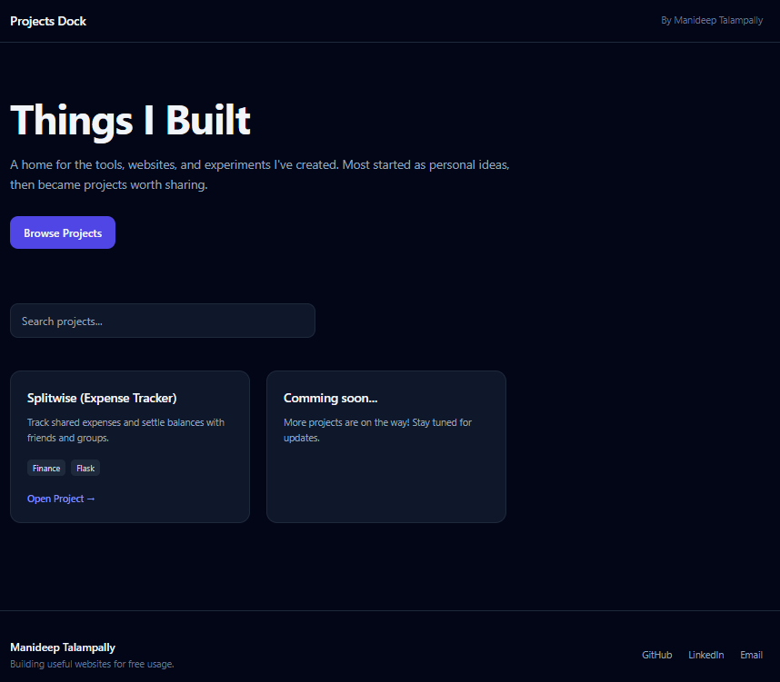

# Personal Portfolio

A simple portfolio website that serves as a central hub for all my hobby and personal projects. It provides quick access to project demos, repositories, and other work through a clean and minimal interface.

## Features
- Simple and responsive design
- Centralized collection of project links
- Fast loading single-page application
- Mobile-friendly layout
- Clean user interface

## Demo
https://projectsdock.vercel.app/

## Screenshot

## Tech Stack
- HTML5
- Tailwind CSS

## Project Structure
├── index.html

## Purpose
This portfolio was created to showcase my projects in one place and make it easy for visitors to explore my work.